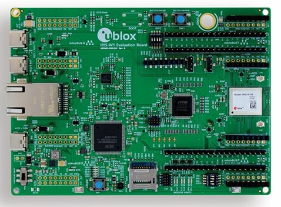

.. zephyr:board:: ubx_evk_iris_w1

Overview
********

The EVK-IRIS-W10x evaluation kit enables stand-alone use of the IRIS-W10 series module. This guide
provides details about the hardware functionality of the EVK-IRIS-W10 board and includes setup
instructions for starting development.

All pins and interfaces supported on IRIS-W10 series modules are easily accessible from the
evaluation board. Simple USB connections serve as the physical interfaces for power, programming
COM ports, debugging, and USB peripheral connectors. Additionally, the board features other
interfaces like Ethernet RJ45 and an SDIO header. The EVK-IRIS-W10 board is equipped with a Reset
button, Boot button, and two user-configurable buttons. Current sense resistors are incorporated for
accurate current measurement within the module.

For flexible use, GPIO signals are accessible through headers and are complemented by four
mikroBUS™ standard slots for convenient utilization of Click boards™. Each Click board can be
seamlessly plugged into an available mikroBUS™ slot to facilitate effortless hardware expansion with
a variety of standardized compact add-on boards. Click boards are designed to accommodate a
diverse range of electronic modules, including sensors, transceivers, displays, encoders, motor
drivers, connection ports, and more. For further information about the Click boards, visit the MIKROE
website

Hardware
********

- 260 MHz ARM Cortex-M33, tri-radio cores for Wifi 6 + BLE 5.3 + 802.15.4
- 1.2 MB on-chip SRAM
- EVK-IRIS-W101 evaluation board with IRIS-W101 module. Dual band PCB antenna for WLAN
   with 100 mm coaxial cable and U.FL connector
- EVK-IRIS-W106 evaluation board with IRIS-W106 module. Dual-band integrated PCB trace
   antenna (external antenna not supplied)

Configuring Flash Memory
========================

   The IRIS-W1 module is available with flash memory from different vendors, specifically Fidelex and
   Macronix. To ensure proper operation, you must configure the software to match the flash memory
   type present on your board.
   This directory contains configuration files for each supported flash memory. You can select the
   appropriate configuration by setting one of the following options in your
   ``ubx_evk_iris_w1_rw612_defconfig`` file:

- ``CONFIG_FLASH_FIDELEX``
- ``CONFIG_FLASH_MACRONIX``

For Module builds up to 2023 week 45, use Macronix flash. For 2346 or later, use Fidelex flash.

Configuring a Debug Probe
=========================

A debug probe is used for both flashing and debugging the board. This board is
configured by default to use the JLink Firmware.

Configuring a Console
=====================

Connect a USB cable from your PC to USB3, and use the serial terminal of your choice
(minicom, putty, etc.) with the following settings:

- Speed: 115200
- Data: 8 bits
- Parity: None
- Stop bits: 1

Flashing
========

Here is an example for the :zephyr:code-sample:`hello_world` application.

Open a serial terminal, reset the board (press the RESET button), and you should
see the following message in the terminal:

.. code-block:: console

**** Booting Zephyr OS build v4.1.0-2794-g6463c68bc394 ****
     Hello World ! ubx_evk_iris_w1/rw612

Wireless Connectivity Support
*****************************

Fetch Binary Blobs
==================

To support Bluetooth or Wi-Fi, ubx_evk_iris_w1 requires fetching binary blobs, which can be
achieved by running the following command:

   west blobs fetch hal_nxp

Bluetooth
=========

BLE functionality requires to fetch binary blobs, so make sure to follow
the ``Fetch Binary Blobs`` section first.

frdm_rw612 platform supports the monolithic feature. The required binary blob
``<zephyr workspace>/modules/hal/nxp/zephyr/blobs/rw61x_sb_ble_a2.bin`` will be linked
with the application image directly, forming one single monolithic image.

Wi-Fi
=====

Wi-Fi functionality requires to fetch binary blobs, so make sure to follow
the ``Fetch Binary Blobs`` section first.

frdm_rw612 platform supports the monolithic feature. The required binary blob
``<zephyr workspace>/modules/hal/nxp/zephyr/blobs/rw61x_sb_wifi_a2.bin`` will be linked
with the application image directly, forming one single monolithic image.

Resources
*********

- `EVK-IRIS-W1 Website <https://www.u-blox.com/en/product/evk-iris-w1>`_
- `EVK-IRIS-W1 Github <https://github.com/u-blox/u-blox-sho-OpenCPU/tree/master/MCUXpresso/IRIS-W1>`_
- `EVK-IRIS-W1 User Guide <https://content.u-blox.com/sites/default/files/documents/EVK-IRIS-W1_UserGuide_UBX-23007837.pdf>`_
